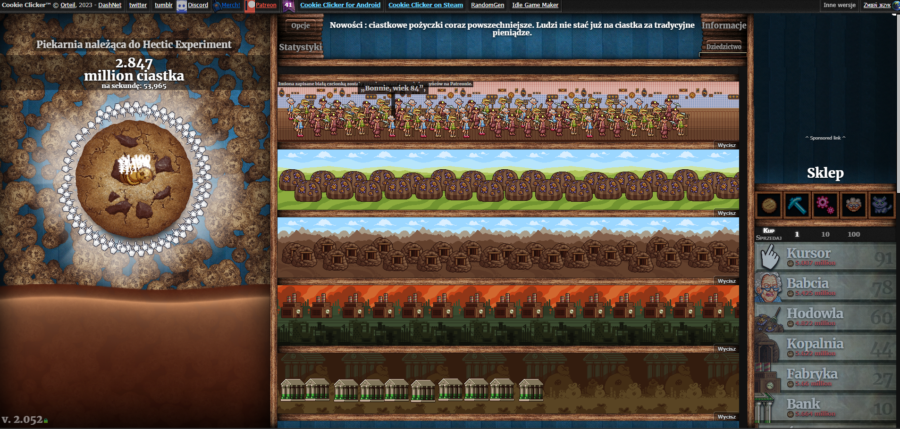

# Automatyzacja Gry "Cookie Clicker"

## Opis
Ten skrypt automatyzuje rozgrywkę w popularnej grze przeglądarkowej "Cookie Clicker", korzystając z narzędzia Selenium. Skrypt jest zaprojektowany do gry w języku polskim.

<p align="center">
  
</p>

## Wymagania
- Python 3.x
- Selenium
- WebDriver Manager
- Keyboard

## Instalacja
1. Zainstaluj Pythona 3.x: [Oficjalna strona Pythona](https://www.python.org/downloads/)
2. Zainstaluj wymagane pakiety:
   ```bash
   pip install selenium webdriver_manager keyboard
   ```

## Użycie
### Uruchomienie ze źródeł:
1. Uruchom skrypt za pomocą poniższej komendy:
   ```bash
   python CookieClickerHACK.py
   ```
2. Otwórz grę "Cookie Clicker" w przeglądarce internetowej.

### Uruchomienie z pliku wykonywalnego:
1. Pobierz plik wykonywalny z [linku do pliku exe](#).
2. Uruchom plik exe.
3. Otwórz grę "Cookie Clicker" w przeglądarce internetowej.

<p align="center">
  
</p>

## Szczegóły Skryptu
- Skrypt otwiera grę w domyślnej przeglądarce internetowej i ustawia język na polski.
- Skrypt oddziałuje z różnymi elementami, takimi jak przycisk "Got it", wybór języka, ustawienia prywatności oraz główne ciasteczko do klikania.
- Skrypt zawiera również funkcje automatycznego zakupu ulepszeń i przedmiotów ze sklepu w grze.
- Naciśnij 'q', aby zatrzymać funkcję klikania, i 'e', aby ją wznowić.

## Ostrzeżenie
Korzystaj z tego skryptu odpowiedzialnie i zgodnie z regulaminem gry. Nadmierne lub zautomatyzowane klikanie może naruszać zasady gry.

## Autor
Flamstak
